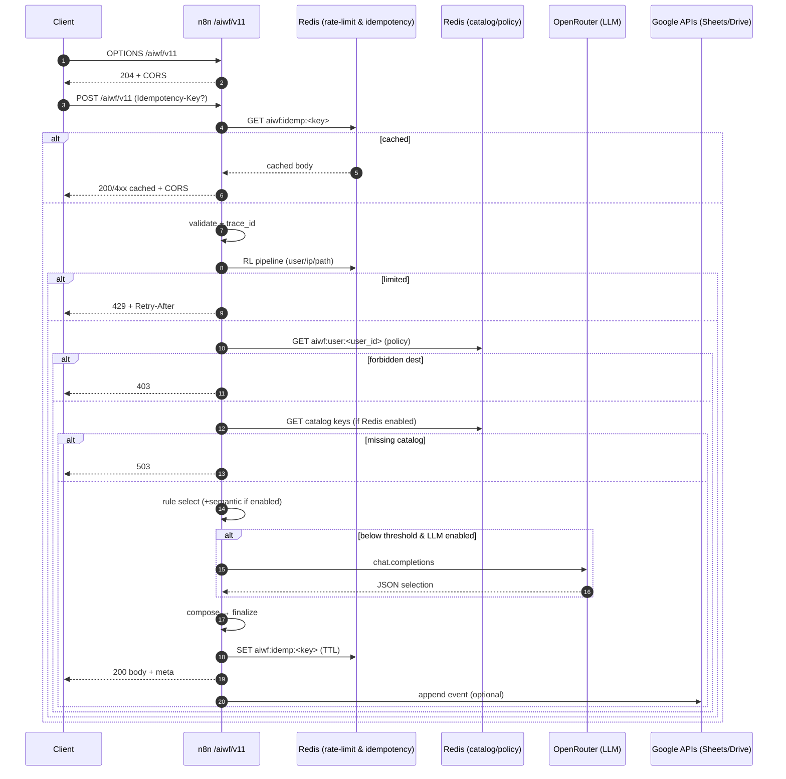

# Architecture — AIWF v11

This doc covers the **node graph**, **phase sequencing**, and **data contracts** for AIWF v11.

---

## High-Level Flow



---

## Node Map (Main)

- **Webhook (OPTIONS/POST) → Config → Validate**
- **Auth+RateLimit (subflow)** → `401/429/503` gates
- **Idempotency GET** (Redis) → short‑circuit on hit
- **Context (env/defaults/hashes)** → per‑user Policy GET + Apply → `403` gate
- **Degrade?** → propagate flag
- **Subflow IDs check** → `503` gate
- **Redis disabled?** → mark catalog unavailable
- **Catalog GET + Merge** → `503` if missing
- **Semantic Select? (subflow)** → `semantic_top`
- **Select Pattern (subflow)** → `rule_score`, `candidate_count`
- **LLM?** → slice top‑K → OpenRouter → strict schema parse/whitelist
- **Compose (subflow)** → variants (trigger/dest/extras)
- **Finalize (subflow)** → file name, node IDs, layout
- **Clamp Response** → strip bulky fields if over size
- **Build Meta** → timings + degraded + trace_id
- **Idempotency SET** → cache result
- **Respond** → headers: `Retry-After`, `X-RateLimit-*`, CORS
- **Event Log** (optional) → Sheets append

---

## Data Contracts

### Policy (`aiwf:user:<user_id>`)
```json
{
  "rl_max": 60,
  "embed_cap": 32,
  "llm_enabled": true,
  "max_nodes": 100,
  "allow_dest": ["sheets","slack","drive"]
}
```

### Catalog
- `aiwf:catalog:id2pattern` — map of `{ id, tags[], description, workflow{...} }`
- `aiwf:catalog:tag2ids` — inverted index `tag -> [ids...]`
- `aiwf:weights` — `{ patterns: { [id]: weight }, updatedAt }` (optional)

### Idempotency
```json
{
  "statusCode": 200,
  "body": { "status": "ready", "...": "..." }
}
```

---

## Phase Timers

`meta.timing` fields are computed from marks:

- `validate_ms`
- `auth_ms`
- `catalog_ms`
- `select_ms`
- `llm_ms`
- `compose_ms`
- `finalize_ms`

Each mark is set immediately after the phase completes.

---

## Security Notes

- **No secrets in responses**. All env-derived values are stripped or hashed (`__uid_hash`, `__q_hash`).
- **Strict JSON-only LLM** with schema validation + whitelist to avoid prompt‑injection‑induced arbitrary JSON.
- **CORS**: Lock `CORS_ALLOW_ORIGIN` in production to a specific origin.
- **Rate‑limit** on user/IP/path prevents shared-key abuse.
- **Idempotency** prevents double charges & replays.

---

## Extending

- Add **new patterns** to the catalog loader; the selector stacks pick them up automatically.
- Plug in other **embedding providers** by swapping the Semantic subflow HTTP node.
- Add **new destinations** by extending the Compose subflow variants and policy `allow_dest`.

---

## Testing Matrix

- ✅ OPTIONS returns 204 with headers
- ✅ POST without auth → 401
- ✅ POST over limit → 429 + headers
- ✅ Missing Redis env → 503 catalog down
- ✅ Missing LLM key → LLM path skipped
- ✅ Idempotency returns cached body
- ✅ Forbidden dest per policy → 403
- ✅ Oversized response → clamped + `meta.truncated=true`

